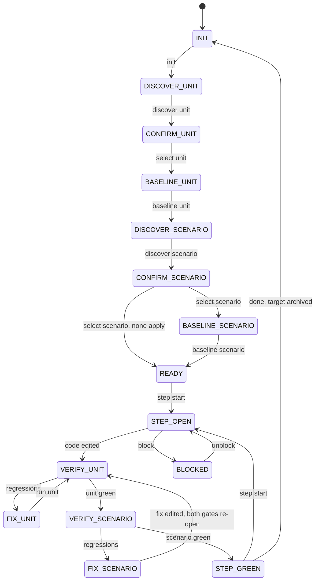
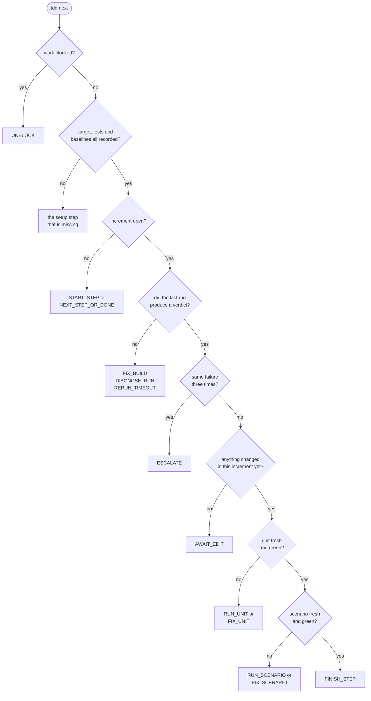
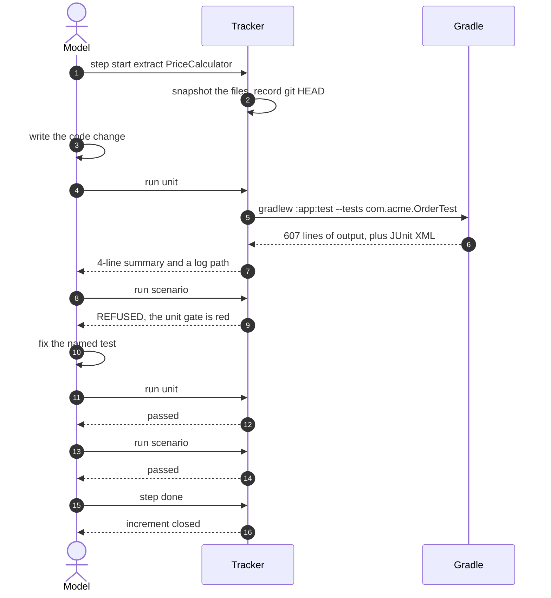
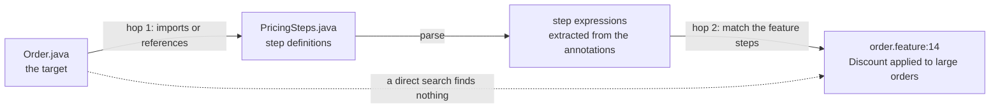
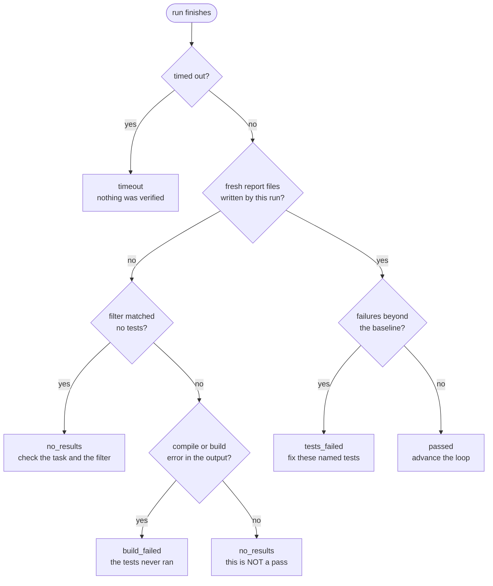
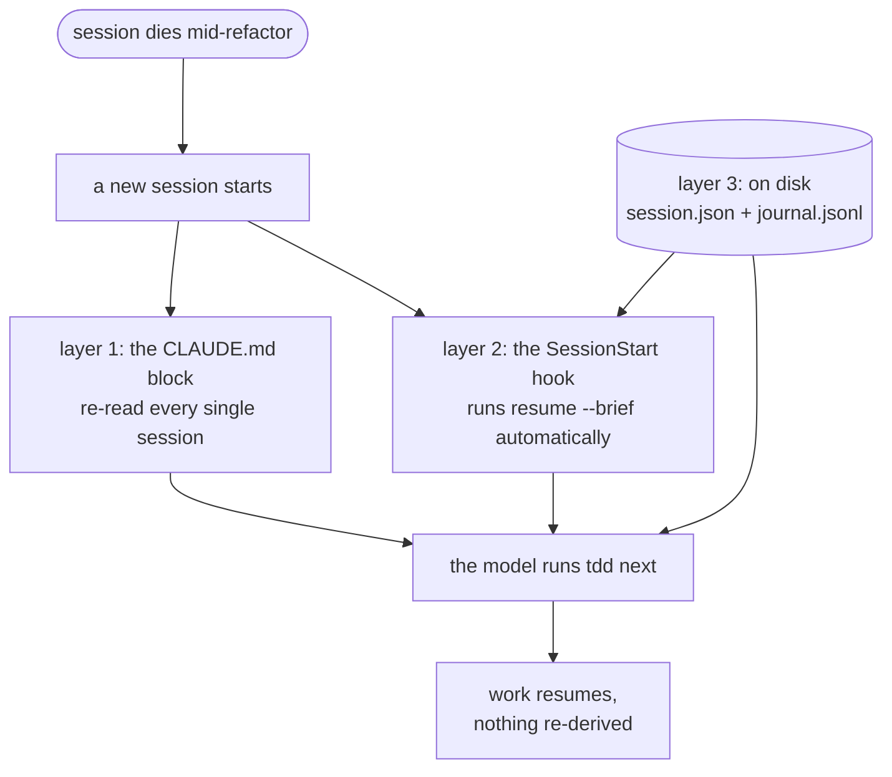
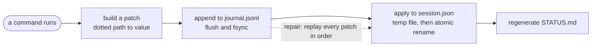

# tdd-memory-skill

Durable memory for an agentic Java refactoring loop in Claude Code.

One Java file at a time: find the JUnit tests that cover it, find the Cucumber scenarios that
exercise it, then refactor in small increments — unit tests green first, scenario tests green second.

The loop position lives on disk, so a dropped connection, a restart or a context window that runs out
before compaction costs nothing. A new session opens already knowing the target, the selected tests,
which gate is red and the exact next command.

**Local only.** Python 3 standard library, no network, no installs, no telemetry. The tracker imports
twelve stdlib modules and a test enforces that list.

---

## Install

```bash
python install/install.py /path/to/your/java-repo
```

That copies the payload into the repo, merges the hooks into `.claude/settings.json` without
disturbing hooks you already have, adds the `.gitignore` entries and the `CLAUDE.md` block, and runs
`doctor`. Re-running it is safe; `--dry-run` shows what it would do.

Windows and POSIX launchers are provided (`install/install.ps1`, `install/install.sh`); both just
hand off to `install.py`.

Requirements: Python 3.8+, a Gradle project with a wrapper. Git is optional — without it an increment
records no base commit, and everything else works.

### Check the setup

```bash
python .claude/tdd/tddstate.py doctor
```

The check most worth reading is **cucumber system-property forwarding**. Unless your build forwards
`-Dcucumber.*` to the test JVM, every scenario filter is silently ignored and the whole suite runs.
`doctor` prints the one-line fix for your build:

```groovy
tasks.named('test') {
    systemProperties System.properties.findAll { it.key.toString().startsWith('cucumber.') }
}
```

Without it the tracker still reports correct verdicts — it filters the results afterwards and says
so — but every run is slower than it needs to be.

---

## Using it

The whole protocol is one command:

```bash
python .claude/tdd/tddstate.py next
```

It prints **one instruction and one command**. Do that one thing, run it again. Nothing has to be
remembered between sessions, and nothing has to be worked out.

```
TDD   target=app/src/main/java/com/acme/Order.java  phase=FIX_UNIT  step=1 "extract PriceCalculator"
UNIT  1 selected | last run 2/3, 1 failing | streak 1
SCEN  2 selected | last run 2/2 green
NEXT  Fix these failing unit tests, then re-run them. Do not touch the scenario tests yet.
      Failing: com.acme.OrderTest#appliesDiscountToLargeOrders. First failure: expected: <135>
      but was: <150>
CMD   python .claude/tdd/tddstate.py run unit
WHY   the unit gate is red; the scenario gate stays locked until it is green
```

A typical target, start to finish:

```bash
tdd init --target app/src/main/java/com/acme/Order.java --goal "extract PriceCalculator"
tdd discover unit        # ranked candidates, with the reason for each
tdd select unit com.acme.OrderTest
tdd discover scenario    # two-hop: target -> step definitions -> feature scenarios
tdd select scenario app/src/test/resources/features/order.feature:14
tdd baseline unit        # before any edit, so pre-existing failures stay pre-existing
tdd baseline scenario
tdd step start "extract PriceCalculator"
#   ... edit the code ...
tdd run unit             # runs gradle, parses the reports, prints ~20 lines
tdd run scenario         # only once unit is green
tdd step done
tdd done                 # archives the target
```

(`tdd` above stands for `python .claude/tdd/tddstate.py`.)

For the human: `/tdd-next`, `/tdd-status` and `/tdd-target <file>` are slash commands, and
`.claude/tdd/STATUS.md` is a readable mirror regenerated on every change.

---

## How it works

### The loop as a state machine

Phases are not decoration: each one has exactly one legitimate next action, which is what lets a
model with no memory of the last hour still do the right thing.



Four things are worth reading twice. `VERIFY_SCENARIO` is reachable **only** from a green unit gate
— that is the ordering guard, and it is enforced in code, not by asking nicely. `BLOCKED` is
reachable from *any* phase, not just `STEP_OPEN` as drawn; only `unblock` leaves it. And `done`
returns to `INIT` rather than to a terminal state: finishing a target archives it and leaves the loop
ready for the next file, so this really is a cycle.

And `FIX_SCENARIO` returns to `VERIFY_UNIT`, not to `VERIFY_SCENARIO`. A scenario failure is repaired
by changing behaviour, and that change can just as easily break a unit test — so the edit invalidates
*both* results, and the gates are re-verified in the usual order. Getting the scenarios green is not
the end of the increment; getting both green **on runs newer than your last edit** is.

The phase is stored for humans and for the journal, but it is never the source of truth for what to
do next. That is recomputed from scratch on every call, so a hand-edited or corrupted phase cannot
send the loop off the rails.

### What `next` decides

`next` is a pure function of state plus a few filesystem facts. Conditions are evaluated **in order**
and the first match wins, so the outcome is completely deterministic — the same state always yields
the same instruction.



The `AWAIT_EDIT` branch exists for a reason that is easy to miss. Baselines are taken *before* an
increment opens, so the moment you open one, the last run is merely "stale". Without that branch
`next` would say "run the unit tests", they would pass, the scenarios would pass, and the model would
close an increment **in which no code was ever written**.

### One increment, end to end



Note what the model never sees: the 607 lines. And note step 9 — the refusal is not advice, it is a
non-zero exit code.

---

## Choosing the work: the file, and the tests

Nominating the file is a human decision. Picking the tests is a three-way split, and the split is
deliberate.

### Nominating the file

Either say it in plain language — "refactor `Order.java`, I want the pricing rule extracted", which
is what the skill's description triggers on — or use the slash command:

```
/tdd-target app/src/main/java/com/acme/Order.java extract PriceCalculator
```

Both end in the same call:

```bash
python .claude/tdd/tddstate.py init --target app/src/main/java/com/acme/Order.java \
    --goal "extract PriceCalculator"
```

`init` resolves the fully-qualified name from the file's `package` declaration, and the Gradle
subproject from the nearest ancestor `build.gradle` (`:app`, or `:services:billing`). It refuses to
replace a target that is still active unless given `--force`; finishing the current one with `done`
is almost always what was meant.

The `--goal` is free text and worth writing properly: it appears in every future session's resume
brief, so it is the one piece of intent that survives a reconnect.

### Who picks the tests

| | Role |
|---|---|
| **The tracker** | *Proposes.* Deterministic, ranked candidates, each with the reason it was found. Never decides. |
| **The model** | *Confirms and prunes.* Runs `select`, which is what makes the choice stick. |
| **You** | *Override at any point.* Name ids directly; discovery has no veto. |

The model runs `select`, but it chooses from a ranked list it did not invent. That is the point:
letting an unreliable model free-associate about which tests are relevant is what produced a
different answer every session.

### How the ranking works

**Unit tests**, from `Order.java` ⇒ `com.acme.Order`:

```
FOUND 3 unit candidate(s)
  [3] com.acme.OrderTest              name match: Order -> OrderTest
  [2] com.acme.checkout.CheckoutTest  imports com.acme.Order
  [1] com.acme.TaxTest                same package com.acme
```

Scores 2 and 1 additionally require a JUnit marker (`@Test` and friends). Without that check a
fixture helper such as `TestData.java` — which names the target constantly but contains no test —
outranks real tests. Step-definition classes and the Cucumber runner are excluded outright: they are
glue, and they belong to the scenario side.

**Scenario tests** need two hops, because feature files never name a Java class:



The dotted line is the whole problem: nothing in `order.feature` mentions `Order`. The connection
only exists through the glue.

```
FOUND 3 scenario candidate(s)
  [3] app/src/test/resources/features/order.feature:14  Discount applied to large orders  @pricing @discount
      step 'the order total is {int}' is defined in PricingSteps.java, which references Order
NOTE  cucumber runner class detected: com.acme.RunCucumberTest
```

| Score | Unit | Scenario |
|---|---|---|
| **3** | name match (`Order` → `OrderTest`) | a step in the scenario is defined in a class that references the target |
| **2** | imports or references the target, and has real tests | a `Background` step matched, or it shares a file with a scoring scenario |
| **1** | same package only | shares a tag with a scoring scenario |

A `Background` step scores 2 rather than 3 because it runs for *every* scenario in its file, so it
implicates all of them — weaker evidence than a scenario's own step.

Matching is regex-first with a literal-fragment fallback. A `Scenario Outline` step reads `Given the
order total is <total>`, which no parameter regex matches, so strict matching would silently drop
every outline in the codebase.

The model then confirms:

```bash
tdd select unit com.acme.OrderTest com.acme.checkout.CheckoutTest
tdd select scenario app/src/test/resources/features/order.feature:14
```

### Four things worth knowing

**Selection is sticky.** It lives in the state file, so a restart never re-derives it. That is the
largest single saving on a reconnect, and — more importantly — it guarantees the *same* tests are
used before and after an interruption.

**Discovery ranks, it never vetoes.** An id it did not find is still accepted, and flagged. If you
know a test matters, say so.

**Re-selecting clears that gate's baseline and last result.** Both described the previous set of
tests, and grading a new selection against the old reference produces quietly wrong verdicts. Get
the selection right before baselining, or expect to re-baseline.

**`select scenario --none`** records that a target genuinely has no Cucumber coverage and skips that
gate entirely — the difference between "verified, nothing to run" and "forgot to check".

On pruning: every selected test runs on *every* verification, so a bloated selection taxes each
iteration of the loop, while a missed test costs you once, later. Prefer a tight selection and add to
it when something surprises you. `.claude/skills/tdd-loop/references/discovery.md` covers the
judgement calls.

---

## What it actually enforces

Four guards live in the program rather than in the prompt, so a model cannot talk its way past them.

**Unit before scenario.** `run scenario` is refused while the unit gate is red. A scenario failing
over a red unit gate tells you nothing — it would fail either way.

**Freshness before greenness.** `step done` is refused when a watched file has changed since the run
that verified it. Each run records the mtime of every file that gate watches as it starts, and a
result is stale when any of those differs now. This is the single most common way an agentic loop
convinces itself it has finished.

The watch is scoped per gate, so one edit does not needlessly re-run everything:

| Edited | Unit gate | Scenario gate |
|---|---|---|
| the target, or a file declared with `step start --file` | re-opens | re-opens |
| a selected unit test | re-opens | untouched |
| a `.feature` file, a step definition, the runner | untouched | re-opens |

Production code affects both. Beyond that the sides are independent: a `.feature` file cannot change
what a unit test does, and a unit test cannot change what a scenario does.

> Why recorded mtimes rather than comparing timestamps? Because the gap between a run starting and an
> edit landing can be **26 microseconds** — measured, not guessed — and filesystems differ in mtime
> resolution. *"Did the edit come before or after the run?"* has no dependable answer at that margin.
> *"Is this the same file that was tested?"* always does. Both orderings of the naive comparison
> produced intermittently wrong verdicts before this was changed.

**Green measured against the baseline.** Tests already failing before you started do not block the
gate; they are counted, not blamed on you. Regressions — tests that passed at baseline and fail now —
are listed first in every summary.

**Three identical failures stop the loop.** Each run gets a failure signature: a hash over the sorted
failing test ids paired with the first line of each message. Stack traces wobble between runs; the
assertion line does not. Three identical signatures in a row means the approach is wrong, not that it
needs another try, so `next` switches to `ESCALATE`: revert the increment, or hand back to the human.

### Reading a Gradle run correctly

Gradle prints `BUILD FAILED` for a compile error, a real test failure **and** a filter that matched
nothing. It prints `BUILD SUCCESSFUL` when it skipped the test task as up-to-date and left last
week's reports lying on disk. Conflating any of these is how a cycle gets wasted, or worse, how a
stale green is believed.



The "fresh report files" test is not incidental. Before every run the tracker deletes the task's
result directory — which both clears stale XML and makes Gradle consider the task out of date, so it
genuinely re-runs. If no new reports appear afterwards, the outcome is `no_results`, never a pass.

### Build output stays out of the context window

The tracker runs Gradle itself. Full output goes to `.claude/tdd/logs/`; the model sees a capped
summary of about twenty lines. Measured in the end-to-end walk, for one failing run:

```
full log on disk    ████████████████████████████████████████████████ 607 lines
shown to the model  ▏ 4 lines
```

Over a long refactor that difference is the entire context budget. The summary lists regressions
first, caps the failure list, truncates each message, and always ends with the log path so the model
can `grep` deliberately instead of being handed everything.

---

## When a session dies

Nothing to do. Run `next`.

### The three layers of memory

Redundant on purpose — the model only has to catch one of them.



Layer 2 is the one that fixes the reported failure mode directly: a reconnecting model opens its very
first turn already knowing the position, without spending a single tool call to find out.

| Layer | Survives |
|---|---|
| `CLAUDE.md` block | everything; it is re-read at every session start |
| `SessionStart` / `PreCompact` hooks | reconnects, compaction, context exhaustion |
| `session.json` + `journal.jsonl` + `STATUS.md` | process kill, reboot, days later, a different human |

### Why the state can always be rebuilt

Every command expresses its change as a **patch** — a map of dotted paths to values — which is
journaled and then applied. Nothing mutates state any other way.



Because the journal is written *before* the state file, it is never behind — only ever ahead. And
because replaying a patch is literally the same operation the command performed, `repair` reproduces
the state **exactly**; there is no separate reducer that can drift out of sync with the mutation
code. A test asserts byte-equality of `session.json` before and after deleting it and rebuilding.

```bash
python .claude/tdd/tddstate.py repair
```

That restores notes, the open increment, the red gate and the attempt counters. A half-written final
line from a hard kill is skipped. `references/recovery.md` covers stale locks, timeouts and the rest.

---

## Layout

```
payload/.claude/           what gets copied into your repo
  tdd/tddstate.py            the tracker: state machine, gradle runner, discovery
  skills/tdd-loop/           SKILL.md + references loaded on demand
  commands/                  /tdd-next, /tdd-status, /tdd-target
  CLAUDE.tdd.md              the block merged into your CLAUDE.md
install/install.py         installer (.ps1 / .sh are launchers)
fixtures/                  sample Gradle project, recorded reports, e2e.py
tests/                     269 tests
DEVPLAN.md                 the design, and why each decision went the way it did
```

Inside your repo at runtime:

```
.claude/tdd/STATUS.md        human-readable mirror
.claude/tdd/state/           session.json + append-only journal.jsonl  (gitignored)
.claude/tdd/logs/            full build output                          (gitignored)
.claude/tdd/snapshots/       per-increment file copies for revert-step  (gitignored)
.claude/tdd/archive/         finished targets                           (gitignored)
```

---

## Tests

```bash
cd tests && python -m unittest discover -s . -p "test_*.py"
```

269 tests, offline, a few seconds. They cover the resolver row by row, the report parsers against
recorded fixtures, discovery against a real sample project, the guards, the installer, and the
documentation itself — every command, flag and action code the skill mentions is checked against the
CLI, because a weak model types what the docs tell it to type.

The end-to-end walk is also runnable on its own:

```bash
python fixtures/e2e.py --keep
```

87 checks against a scratch copy of the sample project, installed the way you would install it,
driving real subprocesses. Gradle is replaced by a stand-in that writes genuine JUnit XML and
Cucumber messages — a real Gradle run would download dependencies, and this project does not use the
network.
